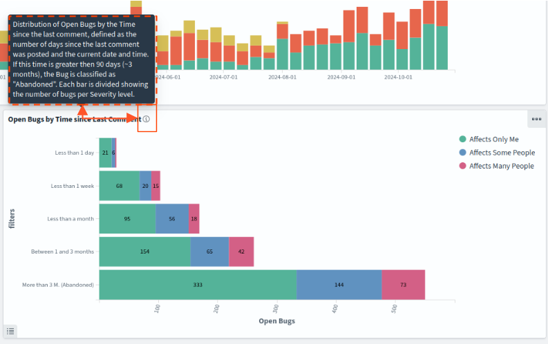
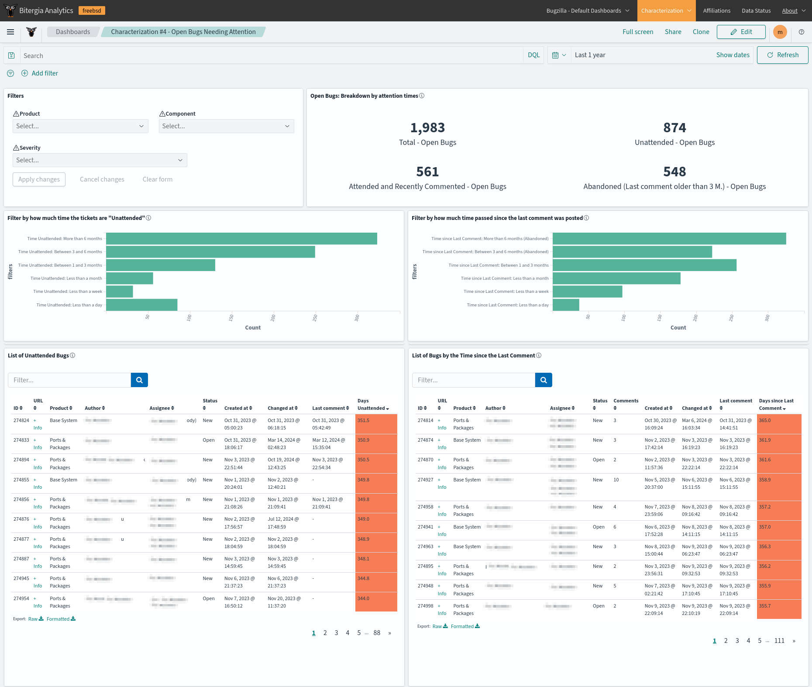

# FreeBSD: Characterization of the Bugzilla Backlog

🤝 This analysis is the result of a partnership between Bitergia and the FreeBSD
Community, as an effort to make a characterization of the backlog from FreeBSD’s Bugzilla
instance.

⚙️ We produced a series of Dashboards to help with this characterization. Learn more
details in the [Characterization Dashboards](#characterization-dashboards) section.

📈 Here you will find the slide deck summarizing the results from the characterization.
Although the whole history has been analyzed, we agreed to focus on the open bugs from
the last two years and the last year, starting with the bugs from the Base System product.
This analysis can be extended to other periods and products by selecting the appropriate
options.

📁 **Index**

* [Slides: Characterization of the Bugzilla Backlog](#slides-characterization-of-the-bugzilla-backlog).
* [Characterization Dashboards](#characterization-dashboards).
* [How to import the dashboards from OpenSearch Dashboards](#how-to-import-the-dashboards-from-opensearch-dashboards).
* [Bugzilla Dataset](#bugzilla-dataset).

## Slides: Characterization of the Bugzilla Backlog

Click [here](docs/FreeBSD-Characterization_of_the_Bugzilla_Backlog.pdf) to access the PDF
version of the slide deck.

## Characterization Dashboards

All these dashboards are available under the `dashboards` folder from this repository.
The instructions to import them into OpenSearch Dashboards are available in [this section](#How-to-import-the-dashboards-from-OpenSearch-Dashboards).

The dashboards contain instructions on how to use them and interpret the different 
visualizations. In most of the widgets, you will see a little "information" button next
to the title. If you place your mouse over this button, you will see a helping text.

### Characterization 1 - Overview

This dashboard offers an overview of the Bugs submitted for all the Products in the
selected period, detailing the amount of activity coming from each Product.

### Characterization 2 -  Backlog Growth

This dashboard focuses on efficiency in closing bugs in the selected time frame. The
Evolution of the Backlog shows how the backlog has changed during the selected time frame,
while the BMI (Backlog Management Index) measures efficiency in closing issues. The
Bugzilla index does not contain the closing date of the Bugs, so the values are
approximated using the date of the last comment in "Closed" bugs.

### Characterization 3 - Open Bugs: Attention times

This dashboard provides a breakdown of the open Bugs submitted during the selected period,
focusing on "Unattended" and "Abandoned" Bugs. A Bug will appear as "Unattended" when it
does not receive any comment from a user different from the author who created it. A bug
will appear as "Abandoned" when there were other comments, but the last comment was made
more than 3 months ago.

### Characterization 4 - Open Bugs Needing Attention

Dashboard focused on the Open Bugs needing more attention, submitted during the selected
period. A Bug will appear as "Unattended" when it does not receive any comment from a user
different from the author who created it. A bug will appear as "Abandoned" when there are
other comments, but the last comment was made more than 3 months ago. By default, Bugs
with severity "Affects Only Me" are excluded.

### Characterization 5 -  Enhanced Bug List

This dashboard offers an enhanced version of the [bug list from Bugzilla](https://bugs.freebsd.org/bugzilla//buglist.cgi?bug_status=__open__&no_redirect=1&order=Importance&query_format=specific),
showing the list of Bugs submitted during the selected period. The results are limited to
2,000, in descending order by their creation date. The "Filters" widget on the left can be
used to narrow down the search. Another way to reduce the number of results is to select a
smaller time frame.

## How to import the dashboards from OpenSearch Dashboards

⚠️ For these dashboards to work, the bugzilla enriched index must be under an alias named
`bugzilla`, because the index pattern and the dashboards point to this alias.

To import the Dashboards provided by Bitergia (including the related visualizations and
the index pattern), go to the “Dashboards Management” section, click on “Saved Objects”
and then “Import.” Then, select the `.ndjson` files under the `dashboards` directory and
import them. We recommend to choose the option "Check for existing objects" and then
select "Request action on conflict".

You can import each dashboard individually, or import all the Characterization
Dashboards at once by selecting the file `all-characterization-dashboards.ndjson`.

Now, the dashboards should be available under the “Dashboards” section.

## Bugzilla Dataset

In this section we describe the structure of the index containing the Bugzilla data. 
This index contains one document per Bugzilla ticket.

### Bugs
        
The documents in this index are about the bugs reported in a Bugzilla instance (one
document per bug). BAP can extract information about the reporters, assignees, and
resolvers of these issues. It can also analyze the status, the number of changes, the
number of comments, and other metadata associated with each bug, such as the Product and
Component on which the bug was reported to.

### Data Model

The information for this data set is provided through indices in OpenSearch.
Those are used to calculate the metrics and charts in the dashboard. In case you
need information about them, it is available below.

| Index Pattern                | Content                       |
|------------------------------|-------------------------------|
| [bugzilla](docs/bugzilla.md) | Bugs of the Bugzilla instance |
